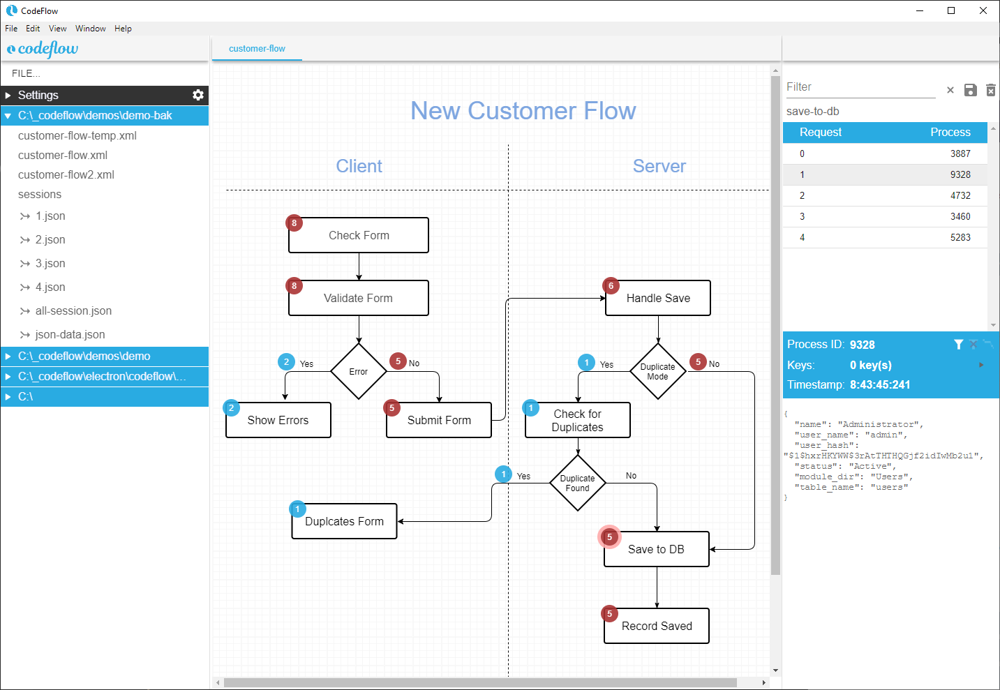
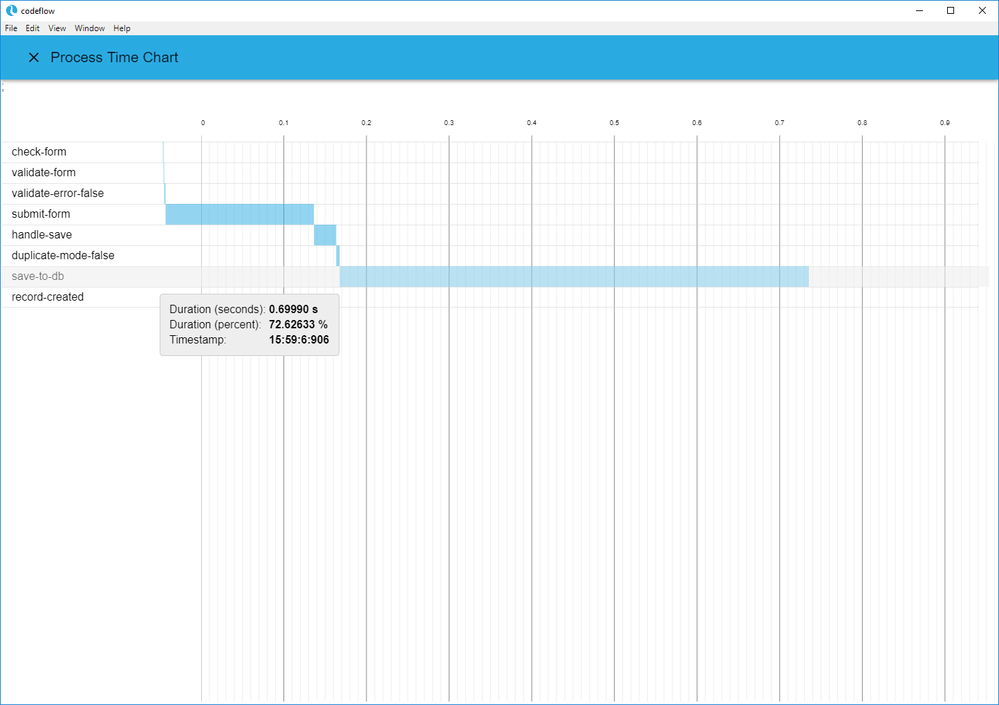

# codeflow
Cross Platform Doc &amp; Debug App
 

Processing time charts
 

  
Introduction demo 
<iframe width="560" height="315" src="https://www.youtube.com/embed/m4dmMj3q8V8" frameborder="0" allow="accelerometer; autoplay; encrypted-media; gyroscope; picture-in-picture" allowfullscreen></iframe>
 
Process Isolation and Debug info demo 
<iframe width="560" height="315" src="https://www.youtube.com/embed/m4dmMj3q8V8" frameborder="0" allow="accelerometer; autoplay; encrypted-media; gyroscope; picture-in-picture" allowfullscreen></iframe>
  
<a href="https://github.com/valcas/codeflow/releases">Download Installer</a>

  
More information at <a href="http://www.codeumentus.com">www.codeumentus.com</a>
